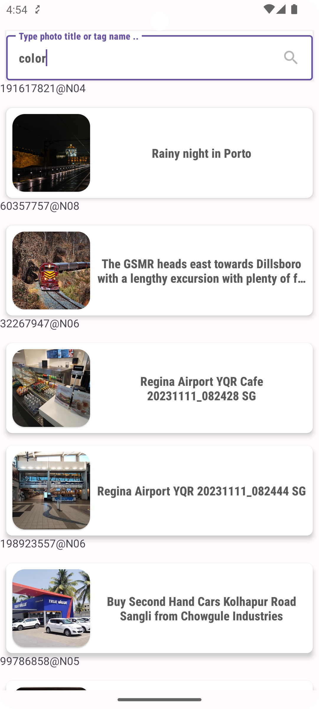
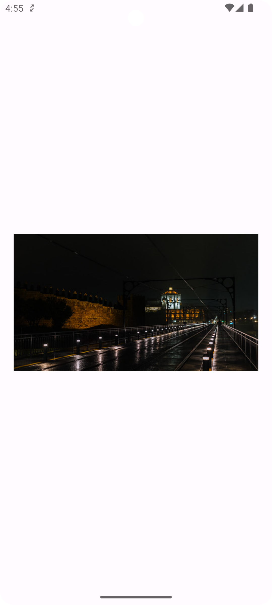

# MoviesFlickrApp
 A demo Android app uses Flickr search API to display a list of photos
## The demo works as follow :
1. The movies screen displays a list of photos with their title according to the user's entered search input (handles error , no data and loading states) with a retry button
2. The movie preview screen which displays the clicked photo item in a single view 

## Architecture pattern: 
MVI model view intent single activity architecture following the Data-Domain-Presentation clean architecture and the UDF unidirectional data flow pattern with repository pattern for data as a layer over different offline/online data sources

## Libraries and dependencies:
1. Constraint Layout for flexible relative positioning and sizing of views
2. Coroutines and flow for asynchronous operations (networking or data store operations)
3. Both data binding and view binding for binding viewmodel data to views
4. glide for image loading
5. Room offline database
6.  Navigation component for handling transitions between fragments
7.  Recyclerview with ListAdapter
8.  Dagger-Hilt for dependency injection
9.  Retrofit/okhttp for networking

## Screenshots:

<kbd></kbd>
<kbd></kbd>

